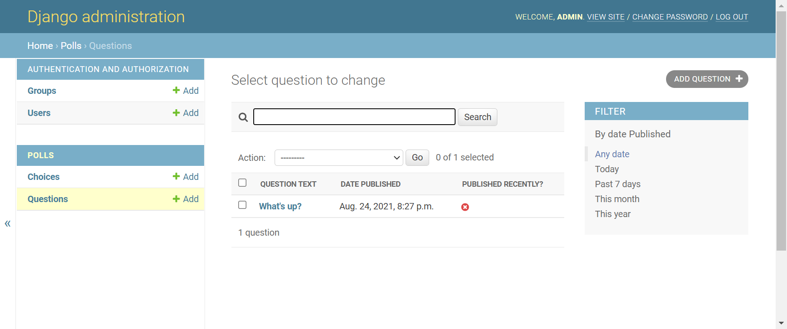
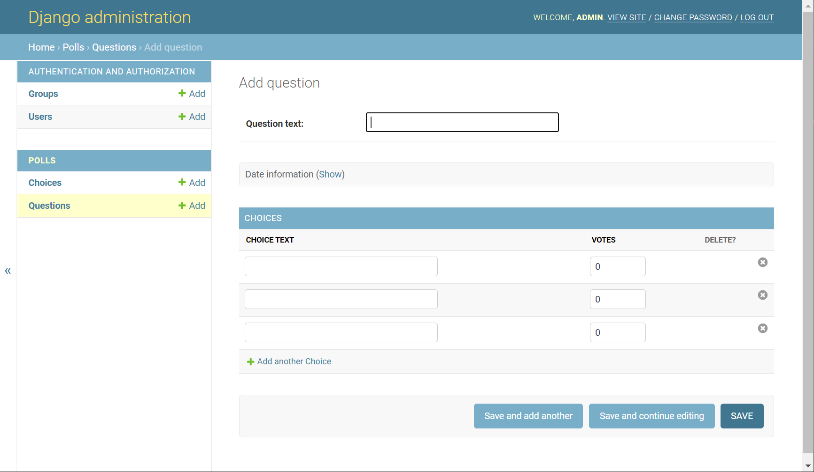
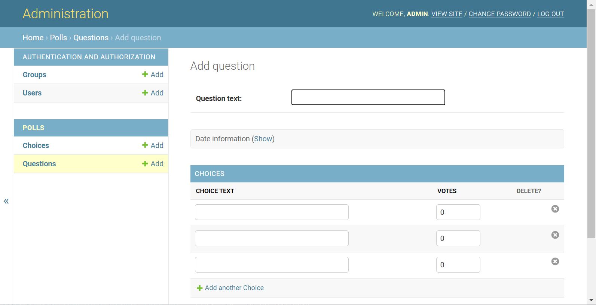

# 07. Custiomize Admin

## 관리자 폼 커스터마이징
-`mysite/settings.py`
```python
TEMPLATES = [
    {
        ...,
        'DIRS': [BASE_DIR / 'templates'],
        ...,
    }
]
```

- `polls/admin.py`
```python
from django.contrib import admin

from .models import Choice, Question


class ChoiceInline(admin.TabularInline):
    model = Choice
    extra = 3


class QuestionAdmin(admin.ModelAdmin):
    fieldsets = [
        (None,               {'fields': ['question_text']}),
        ('Date information', {'fields': ['pub_date'], 'classes': ['collapse']}),
    ]
    inlines = [ChoiceInline]
    list_display = ('question_text', 'pub_date', 'was_published_recently')
    list_filter = ['pub_date']
    search_fields = ['question_text']


admin.site.register(Question, QuestionAdmin)
admin.site.register(Choice)

```

- `polls/models.py`
```python
from django.contrib import admin


class Question(models.Model):
    question_text = models.CharField(max_length=200)
    pub_date = models.DateTimeField('date Published')

    def __str__(self):
        return self.question_text
    
    @admin.display(
        boolean=True,
        ordering='pub_date',
        description='Published recently?',
    )

    # def was_published_recently(self):
    #     return self.pub_date >= timezone.now() - datetime.timedelta(days=1)
    def was_published_recently(self):
        now = timezone.now()
        return now - datetime.timedelta(days=1) <= self.pub_date <= now
```




## 관리자 템플릿 커스터마이징
```
django-tutorial/venv/lib/site-packages/django/contrib/admin/templates/admin/base_site.html
polls/templates/admin/base_site.html 로 복사
```
```html


{{ subtitle }} | {{ title }} | {{ site_title|default:_('Django site admin') }}


<h1 id="site-name"><a href="">Administration</a></h1>



```


- 기타 수정하고자 하는 것은 templates 폴더로 복사해서 수정하면 됨.